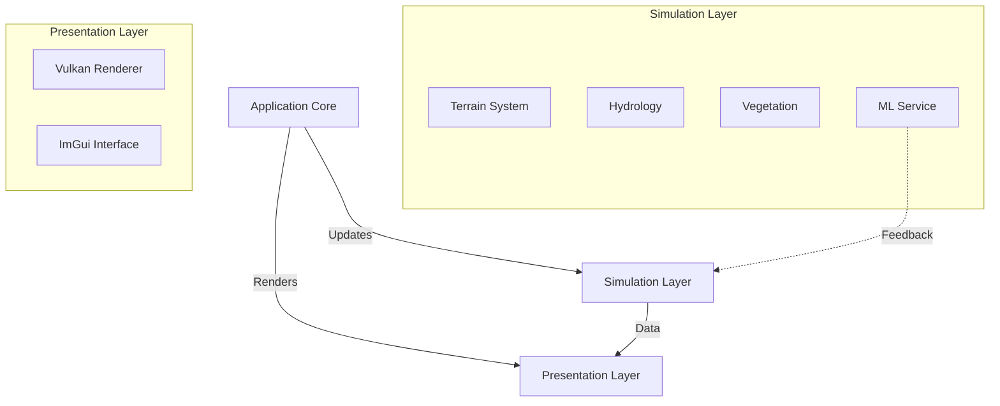

# SisterApp Engine v4.3.0
Plataforma de Ecologia Computacional

> **De Engine Gráfica para Laboratório Digital**: V4.3.0 consolida a plataforma com uma interface científica otimizada e feedback de aprendizado de máquina em tempo real.

SisterApp é uma **Plataforma de Ecologia Computacional** de alto desempenho (C++/Vulkan) focada em simular dinâmicas de paisagem (Hidrologia, Pedologia, Geomorfologia) e validar hipóteses ecológicas através de métricas espaciais rigorosas (LSI, CF, RCC).

Desenvolvido por **José Pedro Trindade**.


---

## 🎯 What's New (v4.3.0)
- **Unified Inspector UI**: Transitioned from floating windows to a professional **Toolbar + Inspector** architecture.
    - **Context-Aware**: Inspector content adapts dynamically to the selected domain tool (Terrain, Hydro, Soil, Veg).
    - **Layout Control**: Resizeable and movable panels for custom workspace organization.
- **ML Hub Feedback**: Real-time dataset size tracking and training status indicators for all integrated ML models.
- **Improved Workflow**: Streamlined experience for rapid iteration on generated landscapes.

### 🌍 Integrated Ecofunctional Landscape Model
The environment is now a fully coupled ecosystem where **Soil, Hydrology, and Vegetation** interact dynamically:

- **Hydro System**: 
    - **D8 Flow Routing**: Real-time water accumulation.
    - **Dynamic Runoff**: Water surplus calculation ($P - I$) driving flux.
    - **Stream Power Erosion**: Topographical modification based on water flow energy.

- **Soil System**:
    - **Dynamic Pedogenesis**: Soil Depth ($d$) evolves based on erosion and deposition.
    - **Organic Matter ($OM$)**: Simulated accumulation affecting soil quality.

- **Vegetation System**:
    - **Ecophysiological Feedback**: Carrying Capacity ($K$) depends on Site Quality ($d \times OM$).
    - **Water Stress**: Plant Vigor ($\phi$) is limited by water availability.
    - **Disturbance Regimes**: Fire (Fuel-driven) and Grazing (Selective) dynamics.

    - **Disturbance Regimes**: Fire (Fuel-driven) and Grazing (Selective) dynamics.

### 🧠 Experimental ML Integration
- **Hybrid Modeling**: A new `MLService` enables **Physics-Guided Machine Learning**.
- **Soil Color**: Neural network (Perceptron) serves as a surrogate model to predict visual soil properties from physical state vectors.
- [📘 Technical Manual: ML Service Integration](docs/manual_tecnico_ml.md)

### Previous Highlights
- **High-Scale Vegetation**: Optimized simulation for 4096² maps (v3.9.2).
- **Interactive Minimap**: Real-time navigation with peak detection (v3.8.0).
- **Landscape Metrics**: LSI, CF, and RCC validation (v3.7.0).

---

## 🛠️ Dependencies

-   **Vulkan SDK** (1.2+)
-   **SDL2** (Window/Input)
-   **Eigen3** (Linear Algebra)
-   **Dear ImGui** (UI - included)

---

## 🔧 Build Instructions

### Linux

```bash
# Install dependencies (Fedora/RHEL)
sudo dnf install vulkan-devel SDL2-devel eigen3-devel

# Install dependencies (Ubuntu/Debian)
sudo apt install libvulkan-dev libsdl2-dev libeigen3-dev

# Build
cmake -S . -B build
cmake --build build

# Run
./build/sisterapp
```

### macOS

```bash
# Install dependencies
brew install vulkan-sdk sdl2 eigen

# Build and run
cmake -S . -B build
cmake --build build
./build/sisterapp
```

---

## 🎮 Controls

### Movement
- **W/A/S/D**: Move forward/left/backward/right
- **Space**: Jump (only when on ground) or Fly Up (Creative Mode)
- **Mouse**: Look around (right-click + drag or toggle mode)
- **Shift**: Run (3x speed boost)
- **Alt**: Slow motion (0.3x speed)
- **Z / X**: Roll left/right (Free Flight)
- **Mouse Wheel**: Zoom (Adjust FOV)
- **[ / ]**: Fine Tune FOV (45–110°)
- **LMB**: Probe terrain info

### Camera
- **Tab/C**: Toggle camera mode (Free Flight / Orbital)
- **Tools Menu**: Enable creative flight for no-clip movement.

### Shortcuts
- **R**: Reset to spawn
- **1-4**: Quick Teleport
- **F5-F8**: Bookmarks (Save/Load)
- **Ctrl+T**: Toggle Theme

### Application
- **Tools → Map Generator**: Real-time control of Terrain Size, Water Level, Roughness, and Seed.
- **Tools → Visuals**: Sun position, Render Distance (Fog), and Minimap toggle.

---

## 🌿 Scientific Models

### 1. Slope Analysis (Geometric)
Classifies terrain based on local inclination (Percentage):
- **Flat (0-3%)**: Plains suitable for construction or agriculture.
- **Gentle Slope (3-8%)**: Transitional areas.
- **Rolling/Ondulado (8-20%)**: Moderate slopes requiring earthworks.
- **Steep Slope (20-45%)**: Challenging terrain, erosion risk.
- **Mountain (>45%)**: Inaccessible terrain.

### 2. Pedology (Landscape Ecology)
Soil distribution is simulated using spatially coherent noise patterns inspired by Landscape Ecology principles (Farina, 2006):
- **LSI (Landscape Shape Index)**: Controls patch edge complexity via Domain Warping.
- **CF (Complexity Factor)**: Controls internal roughness via Fractal Octaves.
- **RCC (Related Circumscribing Circle)**: Controls patch elongation via Anisotropy.
- **Classes**: Hidromórfico, B Textural, Argila Expansiva, Bem Desenvolvido, Raso, Rocha.
- **Validação DDD (v4.3.0)**: Padrões validados pelo `PatternIntegrityValidator` conforme `DDD_Padroes_Manchas_Solo_v0.md`.

### 3. Hydrology (D8)
Deterministic O(N) flow accumulation algorithm:
- Calculates flow direction based on steepest descent.
- Accumulates flux from ridge lines to valleys.
- Visualizes drainage networks (Flux > Threshold).
- Segments terrain into drainage basins (Watersheds).

---

## 🏗️ Architecture Overview

The engine follows a layered architecture to separate scientific simulation from visualization:



For a detailed data flow diagram, please refer to the [Technical Manual](docs/manual_tecnico_modelos.md).

---

## 🚀 Roadmap

-   [x] **v3.5.0**: Finite World & Slope Analysis.
-   [x] **v3.6.0**: D8 Drainage & Watersheds.
-   [x] **v3.7.0**: Semantic Soil & Landscape Metrics.
-   [x] **v3.8.0**: Minimap, Rebranding, & Stability.
    -   [ ] **v3.x**: Scientific Visualization (NDVI Synthesis & Stress Signaling).
    -   [ ] Advanced Texturing (Splatting).
-   [x] **v4.0.0**: Integrated Ecofunctional Landscape (Soil-Hydro-Veg Coupling).
-   [ ] **v5.0.0**: VR Support & Agent Simulation.

---

## 📜 License

This project is licensed under the **GNU General Public License v3.0**.  
See the [LICENSE](LICENSE) file for details.

---

## 👨‍💻 Author

**José Pedro Trindade**  
_Integrated Ecofunctional Landscape Modeling & Visualization_

---

**Explore infinite procedural worlds in 3D! 🌍🎮**
