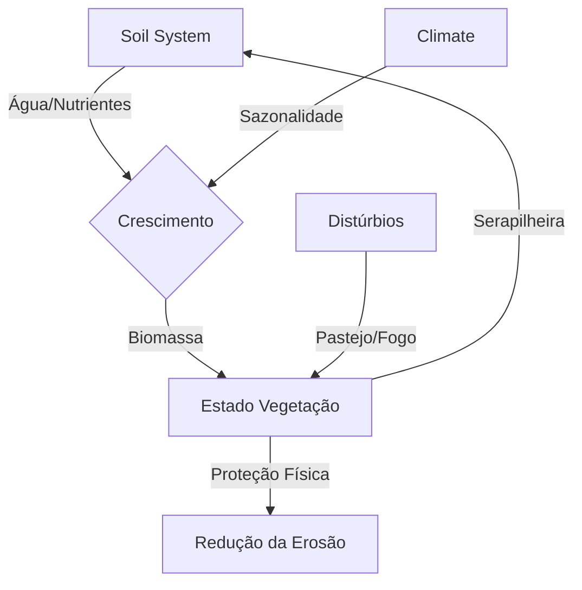

# DDD — Modelo Conceitual: Ecologia da Vegetação Campestre

**Arquivo:** `docs/DDD_Ecologia_Vegetacao.md`
**Versão:** v4.5.0 (Integration with Soil System)
**Data:** 23/12/2025

---

## 1. Visão Geral do Domínio

O subsistema de vegetação simula a dinâmica de **Comunidades Herbáceo-Arbustivas** em resposta a fatores abióticos (Solo/Clima) e distúrbios (Fogo/Pastejo).

A partir da v4.5, este sistema não é mais isolado; ele é um **consumidor ativo** do `SoilSystem` e do `HydroSystem`.

### 1.1 Premissa Ecológica
A vegetação é modelada como a coexistência de dois **Tipos Funcionais de Plantas (PFTs)**:
1.  **Estrato Inferior (Grass/Herbaceous):** Alta resiliência, crescimento rápido, altamente palatável.
2.  **Estrato Superior (Shrub/Woody):** Crescimento lento, maior biomassa, inflamável.

---

## 2. Entidades e Estado (Domain Model)

### 2.1 VegetationGrid (SoA)
Local: `src/vegetation/vegetation_types.h`

Ao contrário de objetos individuais, o estado é armazenado em vetores densos para performance (Data-Oriented Design).

| Atributo | Significado Ecológico | Unidade |
| :--- | :--- | :--- |
| `biomass_grass` | Quantidade de matéria seca do estrato herbáceo. | kg/m² |
| `biomass_shrub` | Quantidade de matéria seca do estrato arbustivo. | kg/m² |
| `vigor` | Saúde fisiológica (verde vs senescente). | 0.0 - 1.0 |
| `burned_fraction` | Memória recente de fogo (para visualização). | 0.0 - 1.0 |

---

## 3. Dinâmica de Simulação (`VegetationSystem`)

O loop de atualização (`VegetationSystem::update`) segue a equação diferencial logística modificada por recursos, como descrito no diagrama abaixo:

### 3.1 Integração SCORPAN (Novidade v4.5)
A vegetação agora lê diretamente propriedades do `SoilGrid`:

*   **Disponibilidade Hídrica:** `SoilGrid::water_content_soil` define o limite superior de crescimento diário.
*   **Fertilidade:** `SoilGrid::labile_carbon` atua como multiplicador de taxa de crescimento intrínseca ($r$).

### 3.2 Feedback Planta-Solo
A vegetação não apenas consome, ela modifica o ambiente:
1.  **Entrada de Carbono:** Biomassa morta vira `dead_biomass` no solo, que decai para `organic_matter`.
2.  **Interceptação:** A cobertura vegetal reduz o impacto cinético da chuva e aumenta a infiltração.

---

## 4. Regimes de Distúrbio

### 4.1 Pastejo (Grazing)
*   **Seletividade:** O gado prefere o Estrato Inferior (Grass) até que este escasseie.
*   **Pressão:** Modelada como remoção direta de biomassa ($\Delta B < 0$).

### 4.2 Fogo (Fire)
*   **Gatilho:** Alta biomassa seca (`vigor` baixo) + Alta temperatura.
*   **Efeito:** Remove instantaneamente biomassa e converte fração em Carbono Recalcitrante (cinzas) no solo.

---

## 5. Linguagem Ubíqua (Glossário)

*   **PFT (Plant Functional Type):** Agrupamento de espécies com função similar.
*   **Capacity ($K$):** O "teto" de biomassa que o ambiente suporta. Dinâmico baseado na água.
*   **Vigor:** Proxy para atividade fotossintética e "verdor" visual.
