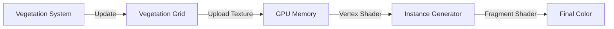

# DDD — Representação Visual: Vegetação Campestre

**Arquivo:** `docs/DDD_Visualizacao_Vegetacao.md`
**Versão:** v4.5.0 (Instanced Rendering)
**Data:** 23/12/2025

---

## 1. O Desafio Visual

Representar, em tempo real, milhões de touceiras de grama e arbustos sobre um terreno de 4096² células requer técnicas avançadas de computação gráfica. Não podemos renderizar um objeto para cada planta individualmente (GameObjects).

## 2. Estratégia de Renderização: Instancing

O sistema utiliza **GPU Instancing** para desenhar a vegetação. O dado biológico (`VegetationGrid`) é traduzido para buffers gráficos.

### 2.1 The Density Map
Não renderizamos 1 planta por pixel do grid de simulação. Usamos um mapa de densidade.
*   O `TerrainRenderer` lê a textura de biomassa.
*   Um Compute Shader (ou lógica no Geometry Shader) espalha instâncias de grama "dummies" baseadas na densidade local.

### 2.2 Ontologia Visual (Tradução Bio -> Gráfico)

| Estado Biológico | Representação Visual |
| :--- | :--- |
| **Biomassa (Grass)** | Altura e Densidade dos *billboards* de grama. |
| **Biomassa (Shrub)** | Escala dos modelos 3D de arbustos esparsos. |
| **Vigor** | Cor (Lerp entre Verde Vigoroso e Amarelo Seco/Palha). |
| **Soil Type (Substrato)** | Variação sutil na tonalidade da base da planta. |

---

## 3. Paleta de Cores e Estética

A estética v4.5 busca o **Foto-Realismo Científico**:
*   Evitar verdes "radioativos". Usar paletas calibradas (Munsell vegetal).
*   Grama seca deve parecer "palha" e não "morta/preta".
*   Arbustos devem ter AO (Ambient Occlusion) para se destacarem do terreno.

---

## 4. Pipeline Técnico

