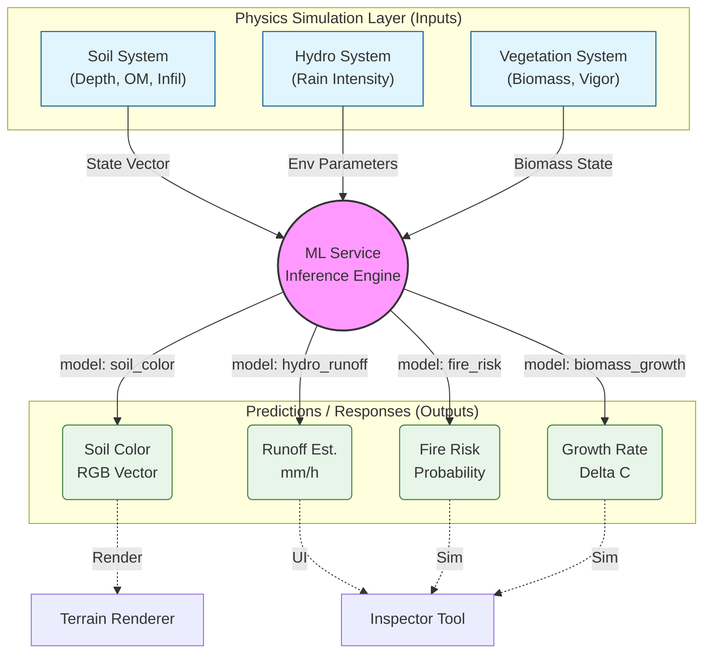

# SisterApp: Manual de Integração Machine Learning Service
**Versão:** 1.0 (Ref: v4.3.7)
**Data:** 22 de Dezembro de 2025
**Módulo:** `src/ml/ml_service.cpp`

---

# 1. Visão Geral
O **ML Service** do SisterApp não é um módulo isolado, mas sim um **Hub de Inteligência Central** que serve a múltiplos domínios da simulação. Ele desacopla a lógica física determinística (leis de conservação) da lógica preditiva (dado-orientada), permitindo "atalhos" e inferências visuais rápidas.

# 2. Arquitetura de Fluxo de Dados (Hub & Spoke)

Este diagrama representa o `MLService` como o núcleo que conecta os sub-sistemas de Pedologia, Hidrologia e Vegetação.

# 3. Catálogo de Modelos (Model Registry)

Abaixo detalhamos a especificação de Entrada/Saída para cada modelo ativo no registro do serviço.

## 3.1. Modelo: `soil_color`
**Domínio:** Pedologia / Visualização
**Objetivo:** Prever a cor visual do solo baseada em propriedades físico-químicas de difícil observação direta.

| # | Input Feature ($\mathbf{x}$) | Range (Norm) | Significado Físico |
|---|---|---|---|
| 0 | Depth ($d$) | 0.0 - 1.0 | Profundidade do solo (proxy para idade). |
| 1 | Organic Matter ($OM$) | 0.0 - 1.0 | Teor de carbono/humus (escurece o solo). |
| 2 | Infiltration ($I$) | 0.0 - 1.0 | Permeabilidade (solos arenosos vs argilosos). |
| 3 | Compaction ($C$) | 0.0 - 1.0 | Densidade aparente (efeito antropogênico). |

**Output ($y$):** Escalar $[0, 1]$ mapeado para um gradiente de cor (ex: $0 \to$ Areia Clara, $1 \to$ Terra Roxa Escura).

---

## 3.2. Modelo: `hydro_runoff`
**Domínio:** Hidrologia
**Objetivo:** Estimar o escoamento superficial instantâneo sem resolver as equações de Navier-Stokes completas.

| # | Input Feature ($\mathbf{x}$) | Range (Norm) | Significado Físico |
|---|---|---|---|
| 0 | Rain Intensity | 0.0 - 1.0 | Chuva normalizada (0 a 100 mm/h). |
| 1 | Eff. Infiltration | 0.0 - 1.0 | Capacidade de absorção do solo atual. |
| 2 | Biomass Total | 0.0 - 1.0 | Interceptação vegetal ($C_{EI} + C_{ES}$). |

**Output ($y$):** Escalar $[0, 1]$ representando o coeficiente de *Runoff* ou volume absoluto normalizado.

---

## 3.3. Modelo: `fire_risk`
**Domínio:** Ecologia de Distúrbios
**Objetivo:** Classificar o risco de ignição de uma célula.

| # | Input Feature ($\mathbf{x}$) | Range (Norm) | Significado Físico |
|---|---|---|---|
| 0 | Coverage EI | 0.0 - 1.0 | Biomassa de gramíneas (combustível fino). |
| 1 | Coverage ES | 0.0 - 1.0 | Biomassa de arbustos (combustível lenhoso). |
| 2 | Vigor EI | 0.0 - 1.0 | Umidade/Saúde das gramíneas. |
| 3 | Vigor ES | 0.0 - 1.0 | Umidade/Saúde dos arbustos. |

**Output ($y$):** Probabilidade de Ignição $P \in [0, 1]$. O modelo aprende a correlação não-linear onde **Alto Combustível + Baixo Vigor = Risco Extremo**.

---

## 3.4. Modelo: `biomass_growth`
**Domínio:** Dinâmica de Vegetação
**Objetivo:** Prever o potencial de crescimento para o próximo passo de tempo (Growth Accelerator).

| # | Input Feature ($\mathbf{x}$) | Range (Norm) | Significado Físico |
|---|---|---|---|
| 0 | Current Bio ($C$) | 0.0 - 1.0 | Estado atual da biomassa. |
| 1 | Carrying Cap ($K$) | 0.0 - 1.0 | Limite máximo local (depende do solo). |
| 2 | Vigor ($\phi$) | 0.0 - 1.0 | "Motor" fotossintético. |

**Output ($y$):** Taxa de crescimento prevista $\Delta C$.

# 4. Pontos de Integração no Código

Onde o `MLService` é efetivamente chamado?

## 4.1. Visualização Híbrida (`TerrainRenderer`)
*   **Arquivo:** `src/terrain/terrain_renderer.cpp`
*   **Método:** `buildMesh()`
*   **Descrição:** Durante a construção dos vértices da malha, o renderizador consulta `mlService->predictSoilColor(...)` para cada vértice. Isso "pinta" o terreno com a inteligência da rede neural, substituindo texturas estáticas.

## 4.2. Sonda Ecológica (`Application::processEvents`)
*   **Arquivo:** `src/core/application.cpp`
*   **Evento:** Mouse Click (Left Button)
*   **Descrição:** Quando o usuário clica no terreno, a ferramenta **Probe** coleta o estado local da célula e envia para todos os 4 modelos do ML Service. Os resultados são exibidos em tempo real na janela de inspeção, permitindo "debuggar" o que a IA "pensa" sobre aquele ponto.

## 4.3. Loop de Treinamento Assíncrono (`Application::uiCallbacks`)
*   **Arquivo:** `src/core/application.cpp`
*   **Descrição:** A interface UI dispara tarefas (`std::async`) que chamam `mlService->trainModel()`. Isso ocorre em background para não travar a simulação física.
